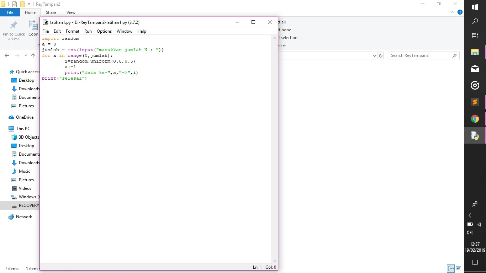
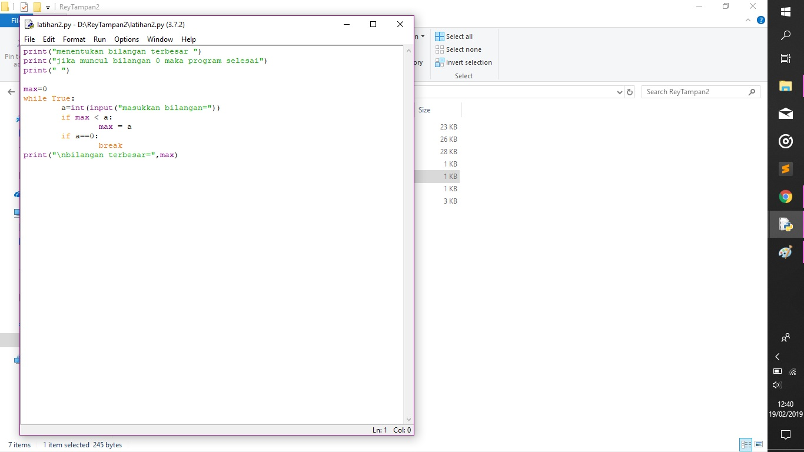
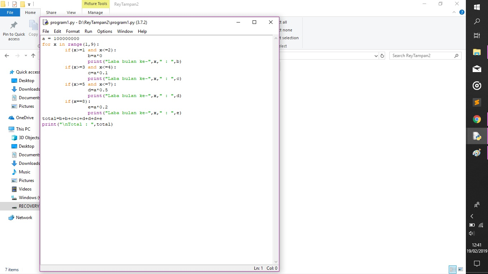

1.-latihan1= program yang digunakan untuk menampilkan bilangan acak
2.-latihan2= program yang digunakan untuk menampilkan bilangan terbesar
3.-program1= program yang digunakan untuk menghitung laba tiap bulan

source kode untuk latihan1

ketik import random untuk memasukan nilai acaknya

lalu masukan variabel dan bilangannya 

Pada line ke 3 user diminta menginputkan bilangan yang mereka inginkan untuk mengisi nilai N

fungsi for atau bisa dibilang fungsi perulangan. "For x in range(0,n)", X adalah index dari perulangan tersebut. Range(0,n) artinya dimulai dari 0 sampai N

lalu print, untuk menampilkan output

source kode untuk latihan2

ketik print untuk menampilkan output awal

lalu masukan variabel dan bilangannya

Perintah while true itu perintah yang di jalankan secara terus menerus sampai menemukan nilai False

lalu masukan variabel input bilangan dan gunakan MAX untuk mencari nilai terbesar

pakai BREAK untuk menghentikan rumus

lalu terakhir, pakai PRINT untuk menampilkan variabel nilai max dan outputnya 

source kode untuk program1

masukan variabel dan bilangannya lalu gunakan FOR untuk menenetukan variabel

lalu gunakan IF untuk untuk menghitung laba 

lalu untuk akhir ketik PRINT untuk menampilkan output dan total laba 

